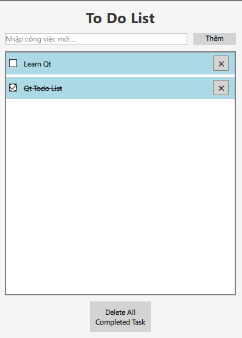

# Qt_TodoList

A simple, yet functional ToDo List application built with Qt Quick and C++.

## Features

- Add new tasks with a user-friendly interface
- Mark tasks as completed with a checkbox
- Remove individual tasks with a delete button
- Delete all completed tasks at once
- Smooth animations when adding or removing tasks
- Responsive scrolling for managing many tasks

## Screenshots



## Requirements

- Qt 6.5 or higher
- C++17 compatible compiler
- CMake 3.16 or higher

## Building the Project

### Using Qt Creator

1. Open Qt Creator
2. Click on "Open Project"
3. Navigate to the project directory and select the `CMakeLists.txt` file
4. Configure the project with the appropriate kit
5. Click "Build Project"

### Using Command Line

```bash
# Create a build directory
mkdir build && cd build

# Configure with CMake
cmake ..

# Build the project
cmake --build .
```

## Project Structure

- `main.cpp` - Application entry point
- `todomodel.h/cpp` - C++ model for managing todo items
- `Main.qml` - Main application window and layout
- `TodoList.qml` - ListView component for displaying todo items
- `TodoItem.qml` - Individual todo item component with checkbox and delete button

## Usage

### Adding Tasks

1. Type your task in the text field at the top
2. Press Enter or click "Thêm" to add the task

### Managing Tasks

- Click the checkbox to mark a task as completed (text will appear with strikethrough)
- Click the "✕" button to remove an individual task
- Click "Delete All Completed Task" to remove all completed tasks at once


## Acknowledgements

- Built with Qt framework
- Inspired by various todo applications
